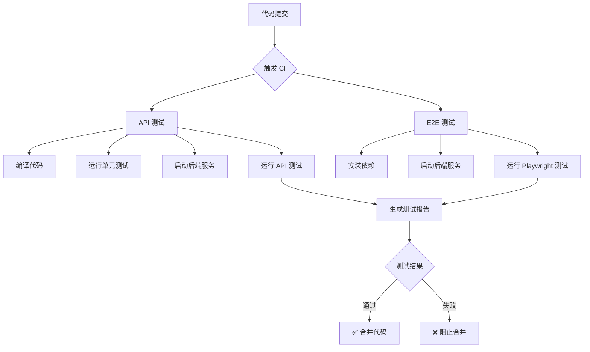

# 🧪 自动化测试覆盖率

[](https://github.com/RichardQidian/OpenClaw_Camera_Construction_Mgmt/actions/workflows/e2e-test.yml)
[](https://github.com/RichardQidian/OpenClaw_Camera_Construction_Mgmt/actions/workflows/api-test-ci.yml)

## 📊 测试统计

| 类别 | 总数 | 自动化 | 自动化率 |
|------|------|--------|----------|
| **API 测试** | 46 | 38 | 82.6% |
| **前端 E2E** | 39 | 39 | 100% |
| **总计** | **85** | **77** | **90.6%** |

## 🚀 CI/CD 流程

### 触发条件

- **Push**: 提交到 `main`, `develop`, `camera1001` 分支
- **Pull Request**: PR 到 `main`, `develop` 分支
- **手动触发**: 可选择测试类型

### 测试流程



### 测试类型

| 工作流 | 说明 | 触发时机 |
|--------|------|----------|
| **API 测试** | 后端 API 自动化测试 | 每次提交 |
| **E2E 测试** | 前端端到端测试 | 每次提交 |
| **系统配置测试** | 验证码配置测试 | 手动触发 |

## 📁 测试文件

### API 测试
- 认证与授权 (3 条)
- 用户管理 (10 条)
- 公司管理 (7 条)
- 角色管理 (6 条)
- 作业区管理 (5 条)
- 个人中心 (2 条)
- 系统管理 (1 条)

### E2E 测试
- 用户注册联动 (12 条)
- 数据隔离 (12 条)
- 匿名注册配置 (10 条)
- 界面与体验 (5 条)
- 系统配置 (5 条)

## 🔧 本地运行

```bash
# 运行所有 E2E 测试
npm run e2e

# 运行特定测试
npm run e2e -- e2e/tests/registration.spec.ts

# 有头模式
npm run e2e:headed

# 查看测试报告
npx playwright show-report e2e/results/html
```

## 📈 测试报告

- **HTML 报告**: GitHub Actions  artifacts
- **JUnit 报告**: GitHub Actions  artifacts
- **后端日志**: GitHub Actions  artifacts

## 🎯 质量门禁

- ✅ 所有测试必须通过
- ✅ 代码覆盖率 > 80%
- ✅ 无严重安全漏洞
- ✅ 性能指标达标

---

*最后更新：2026-03-22*
