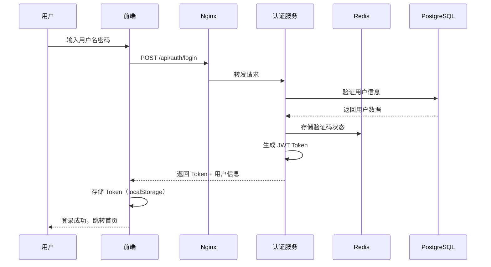
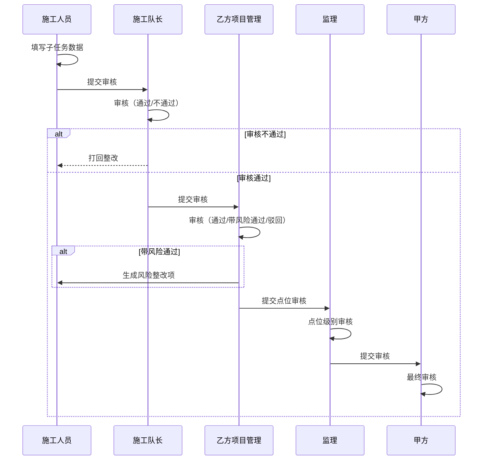
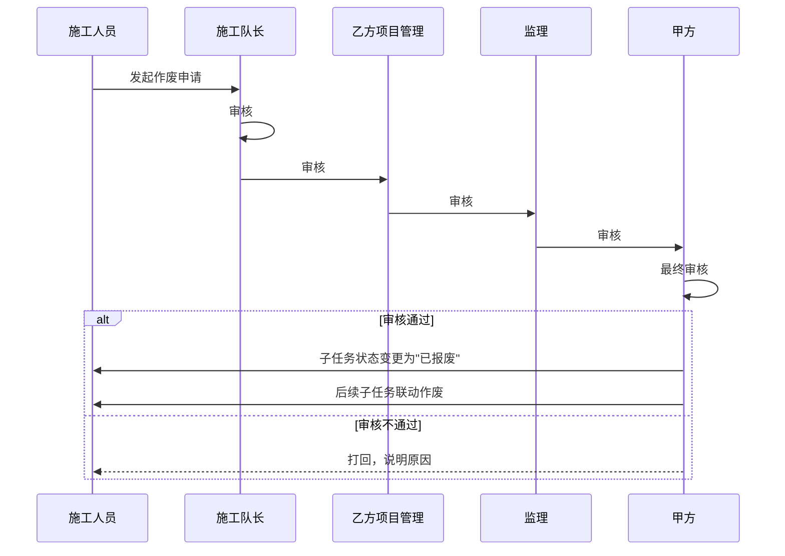

# 摄像头生命周期管理系统 - 软件架构设计 v5.0

> **文档版本**：v5.0  
> **最后更新**：2026-03-10  
> **上一版本**：v3.0  
> **关联文档**：场景故事_v5.0.md、数据库设计文档_v3.0.md

---

## 1. 系统概述

摄像头生命周期管理系统是一个聚焦**项目交付过程管理**和**最终结算管理**的多角色协作平台。系统支持甲方、乙方、监理三方协作，实现项目从开工到施工、验收、结算、运维的全生命周期管理。

### 1.1 系统定位

| 维度 | 说明 |
|------|------|
| **核心功能** | 项目交付过程管理 + 最终结算管理 |
| **不涉及** | 投标管理、中标过程、合同谈判 |
| **用户角色** | 甲方（建设方）、乙方（施工方）、监理（监督方）、系统管理员 |
| **管理对象** | 项目 → 标段 → 点位 → 零部件 |
| **生命周期** | 开工 → 施工 → 审核 → 验收 → 结算 → 运维 |

### 1.2 系统访问方式

- **PC 端**：兼容 Edge、Chrome、360、Firefox 等主流浏览器
- **移动端**：兼容 iOS、Android、HarmonyOS

---

## 2. 架构设计原则

| 原则 | 说明 |
|------|------|
| **分层架构** | 清晰的前后端分离架构，提高可维护性和扩展性 |
| **模块化设计** | 独立的功能模块，便于开发和测试 |
| **高内聚低耦合** | 模块内部高内聚，模块间低耦合 |
| **安全性优先** | 完善的权限管理和数据安全机制 |
| **可扩展性** | 支持新功能和新角色的快速扩展 |
| **性能优化** | 针对批量操作和大数据量查询进行优化 |
| **多终端支持** | 响应式设计和跨平台技术 |

---

## 3. 技术栈选型

### 3.1 整体技术栈

| 分层 | 技术 | 版本 | 选型理由 |
|------|------|------|----------|
| **后端框架** | Spring Boot | 3.2.x | 企业级成熟度最高，生态完善 |
| **开发语言** | Java | 17/21 | LTS 版本，性能优秀 |
| **构建工具** | Maven | 3.9.x | 成熟稳定，依赖管理方便 |
| **前端框架（PC）** | Vue 3 | 3.4.x | 国内生态好，学习曲线低 |
| **UI 组件库** | Element Plus | 2.5.x | 企业级组件库，文档完善 |
| **前端框架（移动端）** | Uni-app | 最新 | 一套代码多端运行（iOS/Android/鸿蒙） |
| **数据库** | PostgreSQL | 16.x | 开源免费，支持 PostGIS 地理空间 |
| **ORM 框架** | MyBatis-Plus | 3.5.x | 简化 CRUD，国内流行 |
| **缓存** | Redis | 7.x | 高性能缓存，支持分布式锁 |
| **文件存储** | MinIO | 最新 | 开源对象存储，兼容 S3 协议 |
| **API 文档** | SpringDoc OpenAPI | 2.x | 自动生成 Swagger 文档 |
| **安全认证** | Spring Security + JWT | - | 成熟的安全框架 |
| **消息队列** | RabbitMQ | 3.12.x | 可靠消息传递 |
| **地理空间** | PostGIS | 3.x | PostgreSQL 空间扩展 |

### 3.2 技术栈对比分析

#### 后端框架选择：Spring Boot

**对比方案**：
| 框架 | 语言 | 优势 | 劣势 | 适用场景 |
|------|------|------|------|----------|
| **Spring Boot** | Java | 企业级成熟、生态完善、性能优秀 | 开发效率较低、内存占用高 | 大型企业级项目 ✅ |
| NestJS | Node.js | 开发效率高、技术栈统一 | 企业级经验较少 | 中小型项目 |
| FastAPI | Python | 开发效率最高、自动文档 | 并发性能受限 | 快速原型/AI 项目 |

**选择 Spring Boot 的理由**：
1. **企业级项目**：甲方/乙方/监理三方协作，业务逻辑复杂
2. **数据一致性要求高**：工程量统计、进度款、结算管理需要强事务支持
3. **权限体系复杂**：RBAC + 作业区数据隔离，Spring Security 最成熟
4. **审计要求**：所有操作留痕，Spring 的 AOP 和事务管理最完善
5. **PostGIS 支持**：Hibernate Spatial 对 PostGIS 支持最好
6. **人才储备**：国内 Java 开发者最多，便于后续维护

---

## 4. 系统架构图

```
┌─────────────────────────────────────────────────────────┐
│                    客户端层                              │
│  ┌────────────────────┐    ┌────────────────────┐       │
│  │   PC 端 Web 应用    │    │    移动端应用       │       │
│  │  Vue3 + ElementPlus│    │     Uni-app        │       │
│  └────────────────────┘    └────────────────────┘       │
└─────────────────────────────────────────────────────────┘
                          │
                          │ HTTPS
                          ▼
┌─────────────────────────────────────────────────────────┐
│                    网关层                                │
│              Nginx（反向代理 + 负载均衡）                 │
└─────────────────────────────────────────────────────────┘
                          │
                          ▼
┌─────────────────────────────────────────────────────────┐
│                    应用层                                │
│           Spring Boot 3.2 应用集群                       │
│  ┌──────────────────────────────────────────────────┐   │
│  │  认证授权 │ 用户管理 │ 项目管理 │ 施工管理       │   │
│  │  点位管理 │ 审核管理 │ 结算管理 │ 系统管理       │   │
│  └──────────────────────────────────────────────────┘   │
└─────────────────────────────────────────────────────────┘
                          │
          ┌───────────────┼───────────────┐
          ▼               ▼               ▼
┌─────────────┐  ┌─────────────┐  ┌─────────────┐
│ PostgreSQL  │  │    Redis    │  │    MinIO    │
│   + PostGIS │  │   (缓存)    │  │  (文件存储)  │
└─────────────┘  └─────────────┘  └─────────────┘
```

---

## 5. 分层详细设计

### 5.1 客户端层

#### 5.1.1 PC 端 Web 应用

**技术栈**：
```
Vue 3.4 + TypeScript + Element Plus + Vite
```

**核心功能模块**：
- 用户登录、注册、个人信息管理
- 项目创建、标段划分、点位管理
- 施工任务分配、进度跟踪
- 审核流程管理（子任务审核、点位审核、作废审核）
- 结算管理（工程量统计、进度款申请、最终结算）
- 数据统计与报表生成
- 项目沙盘（地图可视化）

**设计特点**：
- 响应式设计，适配不同屏幕尺寸
- 模块化组件设计，提高代码复用性
- Pinia 状态管理，管理复杂应用状态
- Vue Router 路由管理，实现页面间导航
- Axios HTTP 客户端，统一 API 调用

#### 5.1.2 移动端应用

**技术栈**：
```
Uni-app + Vue 3 + TypeScript
```

**核心功能**：
- 施工人员现场数据采集（文字、图片、视频）
- 施工进度查看与更新
- 任务接收与提醒
- 简易审核功能
- 消息通知

**设计特点**：
- 跨平台开发，一套代码支持 iOS、Android、HarmonyOS
- 离线数据缓存，支持无网络环境下的数据采集
- 图片/视频压缩上传，节省流量
- 消息推送，及时提醒任务和审核结果

---

### 5.2 网关层

**技术栈**：Nginx

**核心功能**：
- 反向代理，路由请求到应用服务器
- 负载均衡，分发请求到多个应用实例
- HTTPS 终止，SSL/TLS 加密
- 静态资源缓存
- 请求限流与防攻击

**配置示例**：
```nginx
server {
    listen 443 ssl;
    server_name camera.qidian.com;
    
    ssl_certificate /etc/nginx/ssl/camera.crt;
    ssl_certificate_key /etc/nginx/ssl/camera.key;
    
    # 前端静态资源
    location / {
        root /var/www/camera-frontend;
        try_files $uri $uri/ /index.html;
    }
    
    # 后端 API 代理
    location /api/ {
        proxy_pass http://localhost:8080;
        proxy_set_header Host $host;
        proxy_set_header X-Real-IP $remote_addr;
        proxy_set_header X-Forwarded-For $proxy_add_x_forwarded_for;
    }
    
    # 文件上传
    location /uploads/ {
        alias /var/www/camera-uploads/;
        client_max_body_size 100M;
    }
}
```

---

### 5.3 应用层

#### 5.3.1 Spring Boot 应用结构

```
camera-lifecycle-system/
├── pom.xml                              # Maven 配置
├── src/main/java/com/qidian/camera/
│   ├── CameraApplication.java           # 启动类
│   │
│   ├── config/                          # 配置类
│   │   ├── SecurityConfig.java          # 安全配置
│   │   ├── DataSourceConfig.java        # 数据源配置
│   │   ├── RedisConfig.java             # Redis 配置
│   │   ├── SwaggerConfig.java           # API 文档配置
│   │   ├── MybatisPlusConfig.java       # MyBatis-Plus 配置
│   │   └── CorsConfig.java              # 跨域配置
│   │
│   ├── module/                          # 业务模块
│   │   ├── auth/                        # 认证授权模块
│   │   │   ├── controller/
│   │   │   ├── service/
│   │   │   ├── mapper/
│   │   │   ├── entity/
│   │   │   └── dto/
│   │   ├── user/                        # 用户管理模块
│   │   ├── company/                     # 公司管理模块
│   │   ├── project/                     # 项目管理模块
│   │   ├── point/                       # 点位管理模块
│   │   ├── component/                   # 零部件管理模块
│   │   ├── subtask/                     # 子任务管理模块
│   │   ├── audit/                       # 审核管理模块
│   │   ├── construction/                # 施工管理模块
│   │   ├── settlement/                  # 结算管理模块
│   │   └── system/                      # 系统管理模块
│   │
│   ├── common/                          # 公共模块
│   │   ├── exception/                   # 异常处理
│   │   │   ├── BusinessException.java
│   │   │   ├── GlobalExceptionHandler.java
│   │   │   └── ErrorCode.java
│   │   ├── response/                    # 统一响应
│   │   │   └── Result.java
│   │   ├── utils/                       # 工具类
│   │   │   ├── JwtUtil.java
│   │   │   ├── PasswordUtil.java
│   │   │   └── FileUtil.java
│   │   └── constants/                   # 常量定义
│   │       ├── UserStatus.java
│   │       └── AuditStatus.java
│   │
│   └── infrastructure/                  # 基础设施
│       ├── mapper/                      # MyBatis Mapper
│       ├── entity/                      # 实体类
│       ├── dto/                         # 数据传输对象
│       └── repository/                  # 数据访问层
│
└── src/main/resources/
    ├── application.yml                  # 主配置文件
    ├── application-dev.yml              # 开发环境
    ├── application-prod.yml             # 生产环境
    └── mapper/                          # MyBatis XML
```

#### 5.3.2 核心业务模块

| 模块 | 职责 | 主要功能 |
|------|------|----------|
| **auth** | 认证授权 | 用户登录、JWT 签发、权限验证 |
| **user** | 用户管理 | 用户 CRUD、角色分配、作业区关联 |
| **company** | 公司管理 | 公司 CRUD、公司类型管理 |
| **project** | 项目管理 | 项目 CRUD、标段划分、点位分解 |
| **point** | 点位管理 | 点位 CRUD、设备模型指定、零部件实例管理 |
| **component** | 零部件管理 | 零部件种类、属性模板、动态表管理 |
| **subtask** | 子任务管理 | 子任务定义、实例管理、数据填写 |
| **audit** | 审核管理 | 子任务审核、点位审核、作废审核 |
| **construction** | 施工管理 | 施工组织、施工队、任务分配 |
| **settlement** | 结算管理 | 工程量统计、进度款申请、最终结算 |
| **system** | 系统管理 | 角色权限、系统配置、日志管理 |

---

### 5.4 数据层

#### 5.4.1 数据库设计

**数据库**：PostgreSQL 16 + PostGIS 3

**核心表分类**（47 张基础表）：

| 分类 | 表数量 | 主要表 |
|------|--------|--------|
| 用户与权限 | 9 张 | users, roles, permissions, user_roles, role_permissions, work_areas, user_work_areas |
| 项目管理 | 7 张 | projects, project_sections, points, device_models, device_model_components |
| 零部件与模板 | 8 张 | component_types, component_instances, attribute_templates, table_structure_registry |
| 子任务与审核 | 8 张 | subtask_definitions, subtask_instances, subtask_audit_records, risk_rectification_items |
| 施工管理 | 6 张 | construction_orgs, construction_teams, team_members, task_assignments |
| 结算管理 | 6 张 | project_quantities, progress_payment_applications, final_settlements |
| 系统管理 | 6 张 | system_configs, notifications, operation_logs, backup_records |

**动态表设计**：
```sql
-- 零部件属性定义表（动态创建）
component_attr_def_{component_id}

-- 零部件属性值表（动态创建）
component_attr_value_{component_id}

-- 模板属性值表（动态创建）
component_template_value_{template_id}

-- 统一元数据管理
dynamic_attr_def       -- 动态属性定义总表
dynamic_attr_value     -- 动态属性值总表
table_structure_registry -- 表结构注册表
```

#### 5.4.2 缓存设计

**技术栈**：Redis 7

**使用场景**：
| 场景 | 说明 | Key 示例 |
|------|------|----------|
| 会话管理 | 存储用户登录会话 | `session:{userId}` |
| 验证码 | 存储图形/短信验证码 | `captcha:{phone}` |
| 热点数据 | 缓存用户信息、项目信息 | `user:info:{userId}` |
| 分布式锁 | 并发控制 | `lock:point:{pointId}` |
| 限流控制 | API 访问频率限制 | `rate:limit:{userId}` |

**配置示例**：
```yaml
spring:
  redis:
    host: localhost
    port: 6379
    password: ${REDIS_PASSWORD}
    database: 0
    lettuce:
      pool:
        max-active: 20
        max-idle: 10
        min-idle: 5
```

#### 5.4.3 文件存储

**技术栈**：MinIO（开发）/ 阿里云 OSS（生产）

**存储内容**：
- 施工照片和视频
- 文档文件（征地协议、补偿证明等）
- 报表文件（周报、验收报告等）
- 用户头像

**配置示例**：
```yaml
file:
  storage:
    type: minio  # 或 oss
    minio:
      endpoint: http://localhost:9000
      access-key: ${MINIO_ACCESS_KEY}
      secret-key: ${MINIO_SECRET_KEY}
      bucket: camera-system
    oss:
      endpoint: oss-cn-beijing.aliyuncs.com
      access-key: ${OSS_ACCESS_KEY}
      secret-key: ${OSS_SECRET_KEY}
      bucket: camera-system
```

---

## 6. 核心业务流程设计

### 6.1 用户认证流程



### 6.2 子任务审核流程



### 6.3 子任务作废流程



---

## 7. 安全设计

### 7.1 认证与授权

**认证机制**：JWT（JSON Web Token）

**Token 结构**：
```json
{
  "userId": 1,
  "username": "admin",
  "companyId": 1,
  "roles": ["system_admin"],
  "workAreaIds": [1, 2],
  "iat": 1710000000,
  "exp": 1710086400
}
```

**授权机制**：RBAC（Role-Based Access Control）

**权限粒度**：
- 菜单级权限（控制菜单显示）
- 按钮级权限（控制按钮显示）
- API 级权限（控制接口访问）
- 数据级权限（作业区数据隔离）

### 7.2 数据安全

**加密存储**：
- 用户密码：BCrypt 加密
- 敏感信息：AES-256 加密（手机号、邮箱）

**传输安全**：
- HTTPS 协议（TLS 1.3）
- API 签名验证

**访问控制**：
- SQL 注入防护（MyBatis 参数化查询）
- XSS 防护（输入过滤、输出转义）
- CSRF 防护（Token 验证）

### 7.3 系统安全

**防护措施**：
- API 限流（Redis 计数器）
- 登录失败锁定（Redis 记录）
- 异常登录检测（IP 变化提醒）
- 操作日志记录（审计追踪）

---

## 8. 性能与扩展性设计

### 8.1 性能优化

**数据库优化**：
- 合理设计索引（主键、外键、业务查询索引）
- 分页查询（避免一次性加载大量数据）
- 慢查询监控（PostgreSQL pg_stat_statements）

**缓存优化**：
- 热点数据缓存（用户信息、项目信息）
- 缓存预热（系统启动时加载基础数据）
- 缓存过期策略（TTL + 主动失效）

**异步处理**：
- 消息队列（RabbitMQ）解耦耗时操作
- 异步通知（邮件、短信）
- 异步报表生成（周报、结算报告）

### 8.2 扩展性设计

**微服务准备**：
- 模块化设计，便于拆分为微服务
- 服务注册与发现（Nacos/Consul）
- 配置中心（Nacos/Apollo）

**水平扩展**：
- 应用集群（Nginx 负载均衡）
- 数据库读写分离（PostgreSQL 主从复制）
- Redis 集群（哨兵模式/集群模式）

**容器化**：
- Docker 容器化部署
- Kubernetes 编排（可选）
- CI/CD 自动化（Jenkins/GitLab CI）

---

## 9. 部署架构

### 9.1 开发环境

```
┌─────────────┐
│   Nginx     │  端口：80/443
└──────┬──────┘
       │
┌──────▼──────┐
│ Spring Boot │  端口：8080
└──────┬──────┘
       │
┌──────▼──────┐
│ PostgreSQL  │  端口：5432
│   + PostGIS │
└──────┬──────┘
       │
┌──────▼──────┐
│    Redis    │  端口：6379
└──────┬──────┘
       │
┌──────▼──────┐
│    MinIO    │  端口：9000
└─────────────┘
```

### 9.2 生产环境

```
┌─────────────────────────────────────────┐
│          负载均衡层（Nginx/ALB）          │
└────────────────┬────────────────────────┘
                 │
┌────────────────▼────────────────────────┐
│          API 网关集群（Nginx）            │
└────────────────┬────────────────────────┘
                 │
┌────────────────▼────────────────────────┐
│       Spring Boot 应用集群               │
│  ┌─────────┐  ┌─────────┐  ┌─────────┐ │
│  │ 实例 1   │  │ 实例 2   │  │ 实例 3   │ │
│  └─────────┘  └─────────┘  └─────────┘ │
└────────────────┬────────────────────────┘
                 │
    ┌────────────┼────────────┐
    ▼            ▼            ▼
┌─────────┐ ┌─────────┐ ┌─────────┐
│PostgreSQL│ │  Redis  │ │  MinIO  │
│ 主从复制 │ │ 哨兵模式 │ │  集群   │
└─────────┘ └─────────┘ └─────────┘
```

### 9.3 Docker Compose 配置示例

```yaml
version: '3.8'

services:
  nginx:
    image: nginx:1.25
    ports:
      - "80:80"
      - "443:443"
    volumes:
      - ./nginx.conf:/etc/nginx/nginx.conf
      - ./ssl:/etc/nginx/ssl
    depends_on:
      - app

  app:
    image: camera-system:latest
    ports:
      - "8080:8080"
    environment:
      - SPRING_PROFILES_ACTIVE=prod
      - DB_HOST=postgres
      - REDIS_HOST=redis
    depends_on:
      - postgres
      - redis

  postgres:
    image: postgis/postgis:16-3.4
    environment:
      - POSTGRES_DB=camera_construction_db
      - POSTGRES_USER=camera_admin
      - POSTGRES_PASSWORD=${DB_PASSWORD}
    volumes:
      - postgres_data:/var/lib/postgresql/data

  redis:
    image: redis:7-alpine
    command: redis-server --requirepass ${REDIS_PASSWORD}
    volumes:
      - redis_data:/data

  minio:
    image: minio/minio:latest
    command: server /data --console-address ":9001"
    environment:
      - MINIO_ROOT_USER=${MINIO_ACCESS_KEY}
      - MINIO_ROOT_PASSWORD=${MINIO_SECRET_KEY}
    volumes:
      - minio_data:/data

volumes:
  postgres_data:
  redis_data:
  minio_data:
```

---

## 10. 监控与日志

### 10.1 系统监控

**技术栈**：Prometheus + Grafana

**监控指标**：
- JVM 指标（内存、GC、线程）
- HTTP 请求指标（QPS、响应时间、错误率）
- 数据库指标（连接数、查询耗时）
- Redis 指标（内存、命中率）
- 业务指标（在线用户数、任务完成数）

### 10.2 日志管理

**技术栈**：ELK Stack（Elasticsearch + Logstash + Kibana）

**日志级别**：
- ERROR：错误日志（需要立即处理）
- WARN：警告日志（可能有问题）
- INFO：信息日志（正常业务流程）
- DEBUG：调试日志（开发调试用）

**日志内容**：
- 操作日志（用户操作记录）
- 审计日志（敏感操作记录）
- 系统日志（系统运行状态）

---

## 11. 项目实施计划

### 11.1 阶段划分

| 阶段 | 时间 | 主要任务 |
|------|------|----------|
| **需求分析与设计** | 2 周 | 需求确认、架构设计、数据库设计 |
| **基础框架搭建** | 3 周 | Spring Boot 初始化、前端框架搭建、CI/CD配置 |
| **核心功能开发** | 8 周 | 用户管理、项目管理、施工管理、审核管理 |
| **结算管理开发** | 3 周 | 工程量统计、进度款申请、最终结算 |
| **测试与优化** | 3 周 | 单元测试、集成测试、性能优化 |
| **上线部署** | 2 周 | 生产环境部署、数据迁移、用户培训 |

### 11.2 关键里程碑

1. **M1**：基础框架搭建完成（用户认证、权限管理）
2. **M2**：项目管理核心功能完成（项目创建、标段划分、点位管理）
3. **M3**：施工管理核心功能完成（任务分配、数据填写、审核流程）
4. **M4**：结算管理功能完成（工程量统计、进度款申请）
5. **M5**：系统测试完成，准备上线
6. **M6**：系统正式上线

---

## 12. 风险评估与应对

| 风险 | 影响 | 概率 | 应对措施 |
|------|------|------|----------|
| 需求变更频繁 | 项目延期，成本增加 | 高 | 建立需求变更管理流程，定期评审需求 |
| 技术难度较高 | 开发周期延长 | 中 | 提前进行技术调研和原型开发，加强团队培训 |
| 数据安全问题 | 信息泄露，系统安全风险 | 中 | 采用加密技术，定期进行安全审计和漏洞扫描 |
| 系统性能问题 | 用户体验下降 | 低 | 进行性能测试和优化，采用缓存和异步处理 |
| 跨团队协作问题 | 沟通不畅，进度延误 | 中 | 建立有效的沟通机制，定期召开项目会议 |

---

## 13. 总结

摄像头生命周期管理系统 v5.0 采用前后端分离的微服务架构设计，支持多角色、多终端访问，实现了项目从开工到施工、验收、结算、运维的全生命周期管理。

**技术选型**：
- 后端：Spring Boot 3.2 + Java 17 + MyBatis-Plus
- 前端：Vue 3 + Element Plus + Uni-app
- 数据库：PostgreSQL 16 + PostGIS 3
- 缓存：Redis 7
- 文件存储：MinIO / 阿里云 OSS

**核心特点**：
- 企业级安全（Spring Security + JWT）
- 灵活的权限体系（RBAC + 数据隔离）
- 高性能架构（缓存 + 异步 + 集群）
- 可扩展设计（模块化 + 容器化）
- 完善的监控（Prometheus + ELK）

系统具有良好的可扩展性、安全性和性能，能够满足甲方、乙方和监理三方的协作需求，提高项目管理效率和施工质量。

---

**文档版本**：v5.0  
**最后更新**：2026-03-10  
**编写人员**：系统架构师  
**审核人员**：技术总监
